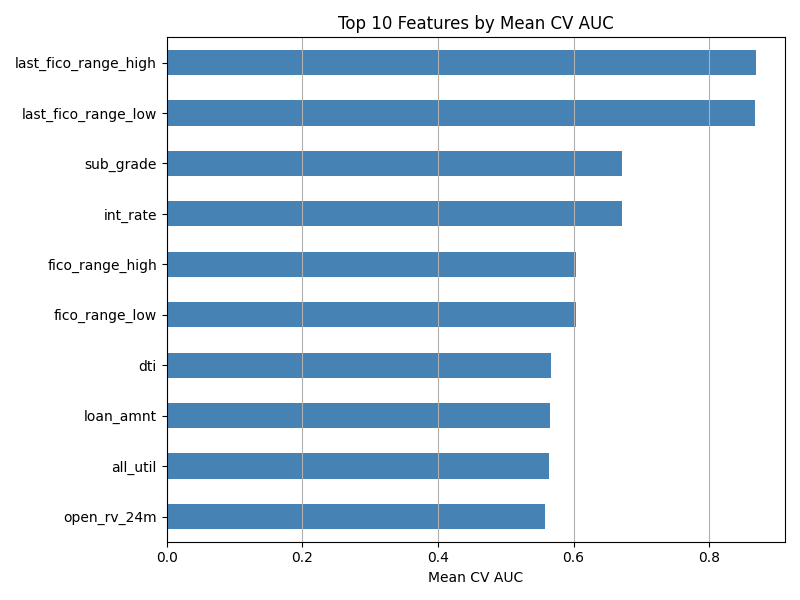
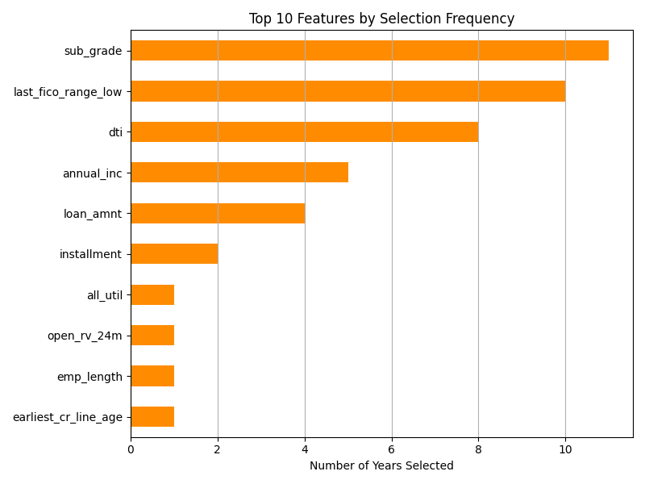
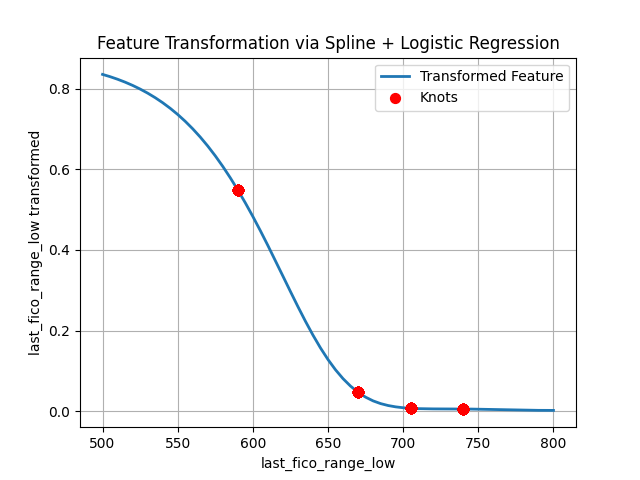
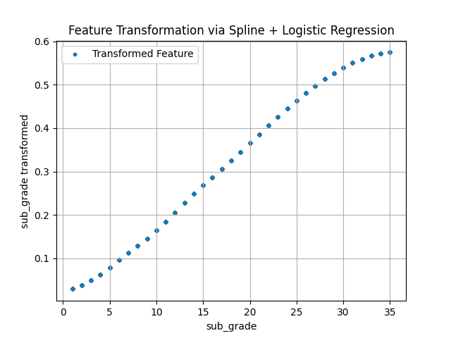
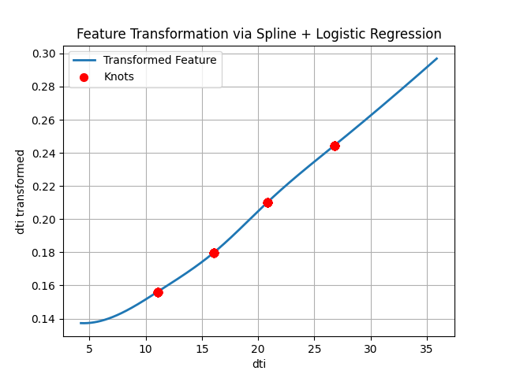
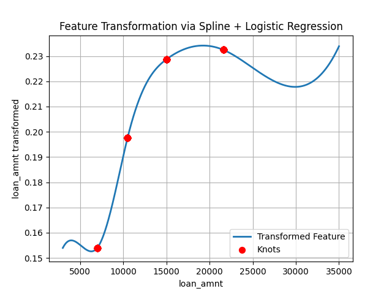
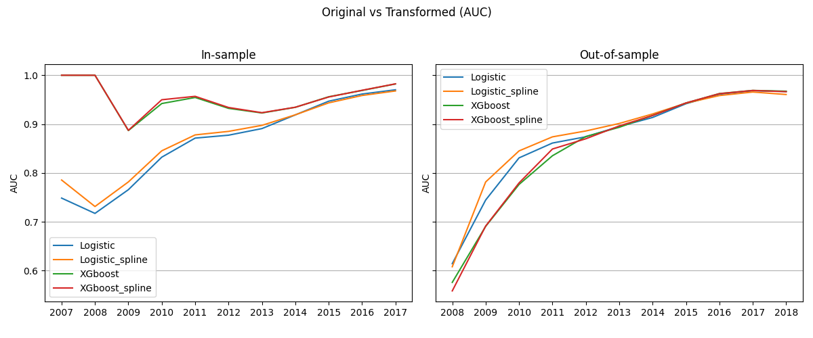
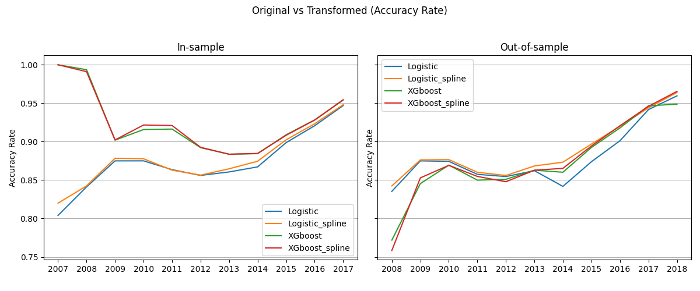

# Loan Default Prediction with Supervised Spline Feature Transformation

This project investigates the use of a supervised, nonlinear feature transformation approach based on cubic spline basis and logistic regression to improve loan default prediction. It is designed to handle nonlinear effects and enhance the information of features.

## Motivation

Accurately predicting whether a loan will be fully paid or charged off is an important task in credit risk modeling. This project utilized a transformation method by [1] where each numerical feature is nonlinearly mapped via cubic spline basis and fitted with a supervised logistic model to produce a probability-like transformed feature. The approach improve the information of a feature and consequently the prediction power of a model.

We compare the performance of models using these transformed features against models using original features across multiple years and classifiers (Logistic Regression and XGBoost).

## Code Structure Overview
- **`data_process.py`**  
Preprocesses raw LendingClub data year by year. Key steps include:
	-   Filtering to loans that are either _Fully Paid_ or _Charged Off_.
	    
	-   Cleaning and transforming date fields and text entries.
	    
	-   Engineering features like `TotalGain`, `PvGain`, `LoanStatus`, and `LifeOfLoan`.
	    
	-   Handling missing values, label and one-hot encoding.
	    
	-   Outputs cleaned yearly datasets to `Processed data/processed_{year}.csv`.
	
- **`functions.py`**  
This module contains all reusable functions and classes used throughout the project. Key components include:
	-   `SplineLogisticFeatureTransformer`: Performs supervised feature transformation using cubic spline basis and logistic regression.
	    
	-   `cv_auc_compute`: Computes cross-validated AUC for feature evaluation.
	    
	-   `recursive_vif_elimination`: Applies VIF-based multicollinearity removal.

- **`features.py`**  
Performs year-by-year feature transformation and feature selection:
	-   For continuous variables: uses spline + logistic transformation, then cross-validated AUC for selection.
	    
	-   For discrete variable groups: evaluates AUC using grouped dummy variables (e.g., `purpose`, `home_ownership`).
	    
	-   Applies VIF-based elimination to reduce multicollinearity.
	    
	-   Outputs selected features and their spline-transformed versions to CSV.

- **`model.py`**  
    The main driver script. It loops over yearly train-test splits of LendingClub data, trains models (logistic regression, XGBoost), and evaluates performance on both original and transformed features. Results are saved in CSV files (`auc.csv`, `accuracy_rate.csv`).
    
-   **`visualization.py`** 
    Script for visualizing results and generating all figures.

## Supervised Spline Feature Transformation

Let $x \in \mathbb{R}$ be a numerical feature and $y \in \{0, 1\}$ indicate loan default where $y=1$ represents a "charged off" loan.

We apply the following transformation for each feature:

1. **Cubic Spline Basis Expansion**  
   We expand $x$ into a set of spline basis functions $(B_1(x), B_2(x), \ldots, B_K(x))$ with degree $d=3$ (cubic) and with knots placed at empirical quantiles $20\%,40\%,60\%,80\%$. Each spline basis function $B_k(x)$ is defined as either a standard polynomial or a truncated cubic function. Specifically, for knots $\kappa_1 < \kappa_2 < \ldots < \kappa_4$, the basis has the form:
   
   $B_1(x) = 1 \quad \text{(optional; excluded if no intercept)}$
   
   $B_2(x) = x$
   
   $B_3(x) = x^2$
   
   $B_4(x) = x^3$
   
   $B_{4 + j}(x) = (x - \kappa_j)^3_+ = \max(0, x - \kappa_j)^3, \quad j = 1, \dots, 4$

	This basis has dimension $K = 8$ if intercept is included, or $K = 7$ otherwise ensures that the resulting spline is continuous and has continuous first and second derivatives across all knot locations (i.e., $C^2$ smoothness).

3. **Logistic Regression on the Spline Basis of a Single Feature**  
   For a logistic model using the spline basis of a single feature $x$, we have
   
   $P(y = 1 \mid x) = \sigma\left( \beta_0 + \sum_{k=1}^{K} \beta_k B_k(x) \right)$
   
   where $\sigma(z) = \frac{1}{1 + e^{-z}}$ is the sigmoid function and the intercept term of the basis is excluded. We maximize the log-likelihood with respect to the parameter vector $\boldsymbol{\beta} = \{\beta_0, \ldots, \beta_K\}$ and obtain the fitted coefficients $\hat{\boldsymbol{\beta}}$.


5. **Transformed Feature**  
   The transformed feature $\tilde{x}$ is then defined as the model's fitted probability for $x$:
   
   $\tilde{x} := \hat{P}(y = 1 \mid x) = \sigma\left( \hat{\beta}_0 + \sum_{k=1}^{K} \hat{\beta}_k B_k(x) \right)$
   
   where $\hat{\boldsymbol{\beta}} = \{\hat{\beta}_0, \ldots, \hat{\beta}_K\}$ are the estimated coefficients. 

	This transformation captures both the nonlinear effect of $x$ on the target variable and the supervised signal from $y$. Unlike unsupervised methods such as PCA or standard polynomial expansions, it is explicitly learned with respect to the classification objective. As a result, $\tilde{x}$ represents the estimated probability of default based solely on the single feature $x$, yielding a meaningful and interpretable output bounded between 0 and 1.
	
	Conceptually, it compresses the nonlinear relationship between a single feature and the target into a scalar summary that is directly usable by downstream models. It can be viewed as a supervised embedding of each feature into a one-dimensional representation optimized for classification tasks.


## Project Pipeline
This section outlines the end-to-end modeling workflow, including data processing, feature transformation, selection, and predictive modeling.
1. **Data Preparation**

  - LendingClub data (2007–2018) from Kaggle
  - Filter for "Fully Paid" and "Charged Off"
  - Split into `loan_YYYY.csv` and store in `Raw data/`

2. **Feature Engineering & Transformation**

- Clean, encode, and impute features. The processed dataset is then saved as `processed_YYYY.csv` under the `Processed data/` directory.
- For each numerical feature:  
  - Create a cubic spline basis  
  - Fit a logistic model to predict default  
  - Use the predicted probability as the transformed feature  
- Once each logistic model is fitted on year $t$, we use the estimated coefficients to transform the corresponding feature for both year $t$ (in-sample) and year $t+1$ (out-of-sample). The transformed features from year $t$ are used for feature selection, while those from year $t+1$ are used for future prediction.

3. **Feature Selection**

	Feature selection is conducted using spline-transformed features from year $t$. We rank features based on their 5-fold cross-validation AUC scores and apply a recursive variance inflation factor (VIF) filter to remove highly collinear variables. Specifically, features with VIF greater than 10 are iteratively removed, while ensuring that at least three features remain.

   The selected features from year $t$ are then used to train models that predict outcomes in year $t+1$, preventing any lookahead bias in both the transformation and selection processes.

4. **Feature Importance**

	For each numerical feature, we compute the average of its 5-fold cross-validated AUC scores across all available years. The figure below shows the top features ranked by their mean AUC, providing insight into which features consistently exhibit strong predictive power.
	
	
	We also track how often each feature is selected across years. The figure below shows the top 10 features with the highest selection frequency, highlighting those that consistently pass both performance and multicollinearity criteria.
	

	Here we also presents several transformed features frequently selected.
	- last_fico_range_low: Lower bound of the borrower's FICO score range reported in the most recent credit report.

	- sub_grade: Credit rating ranging from A1 (highest) to G5 (lowest) which is converted into 1 to 35.
	
	- dti: Total monthly debt payments divided by monthly income.
	
	- loan_amnt: The total amount of the loan issued to the borrower.
	
	
	These plots illustrate how spline-based logistic transformation captures the nonlinear relationship between individual features and default probability.

	For example, `last_fico_range_low` shows a clear monotonic decreasing relationship with default risk, aligning with the intuition that higher credit scores indicate lower risk. Similarly, `sub_grade`, after being ordinally encoded, exhibits a smooth increasing trend in estimated default probability, which preserves the inherent credit ranking.

	In contrast, `loan_amnt` and `dti` demonstrate more complex patterns. For `loan_amnt`, the default risk increases in the lower to mid-range but slightly flattens or even reverses at higher amounts, possibly reflecting stricter underwriting for larger loans. For `dti`, the transformed curve is smooth and increasing, matching the expectation that higher debt burdens correspond to greater credit risk.

	These feature-specific transformations are learned in a supervised manner, allowing the model to encode nonlinear predictive signals without imposing rigid assumptions. Importantly, the resulting transformed features are bounded, interpretable, and visualizable—each curve can be understood as the model’s best estimate of default probability as a function of a single input variable, enhancing both transparency and auditability of the modeling process.


6. **Model Training & Evaluation**

	We evaluate model performance using two classifiers: logistic regression (with L2 regularization) and XGBoost (with default parameters). For each year $t$, we train a model using features from year $t$ and test its performance on data from year $t+1$. Both raw and spline-transformed features are used for comparison.
	
	Two metrics are used for evaluation:
	- AUC (Area Under the ROC Curve), which measures ranking quality
	- Accuracy rate, which reflects threshold-based classification performance

	The plots below compare performance across years for all model-feature combinations, separated into in-sample (training year) and out-of-sample (next year) settings.
	
	

	The results show that spline-transformed features generally lead to better or comparable performance, especially in out-of-sample AUC. This improvement is more noticeable for logistic regression, as the transformation helps capture nonlinear patterns that a linear model cannot express directly. XGBoost, being a nonlinear tree-based model, benefits less but still maintains stable gains.

	The consistent upward trend in out-of-sample AUC and accuracy over the years suggests that the transformation pipeline improves feature robustness and generalizability across time.
   

## Results Summary

- Spline-transformed features generally outperform raw features in both out-of-sample AUC and accuracy rate, demonstrating their ability to enhance the predictive performance of downstream models—especially when using a limited number of features.
- By using a cubic spline basis with supervised logistic fitting, each feature is transformed into a scalar that encodes compressed nonlinear predictive information.
- The effect of each transformed feature on the outcome remains interpretable, as the model's response curve can be directly visualized and understood in terms of estimated default probability.


## Future Extensions

- To capture feature-level nonlinearity, one may apply cubic spline expansion directly to the original features within a logistic regression model. 
	- However, this leads to a significantly higher-dimensional model, as the number of basis terms increases rapidly with the number of features. While this may offer a better in-sample fit, it often results in severe overfitting, especially when the number of samples is limited. 
	- In contrast, our supervised spline-logistic transformation produces scalar outputs that preserve interpretability, avoid unnecessary dimension inflation, and maintain robustness across time—without requiring the use of highly complex models.

- Use AUC-maximizing loss functions (e.g., pairwise logistic loss), which directly target the ranking objective:

  $\sum_{(i,j): y_i = 1, y_j = 0} \log\left(1 + e^{-(f(x_i) - f(x_j))} \right)$

  Compared to standard log-loss, this objective aligns better with AUC and is more robust to class imbalance. It also eliminates the need to select arbitrary classification thresholds.

- Explore buffered AUC (bAUC) as an alternative to standard AUC optimization. The bAUC concept is derived from the Buffered Probability of Exceedance (bPOE), which is closely related to the Conditional Value-at-Risk (CVaR). The resulting optimization problem is convex and can be formulated as a linear program, without requiring surrogate approximations of the objective.


## How to Run

1. Download LendingClub data and split into yearly files.
2. Place CSVs into the `Raw data/` folder.
3. Run pipeline scripts:

```bash
python src/data_process.py
python src/features.py
python src/model.py
python src/visualization.py
